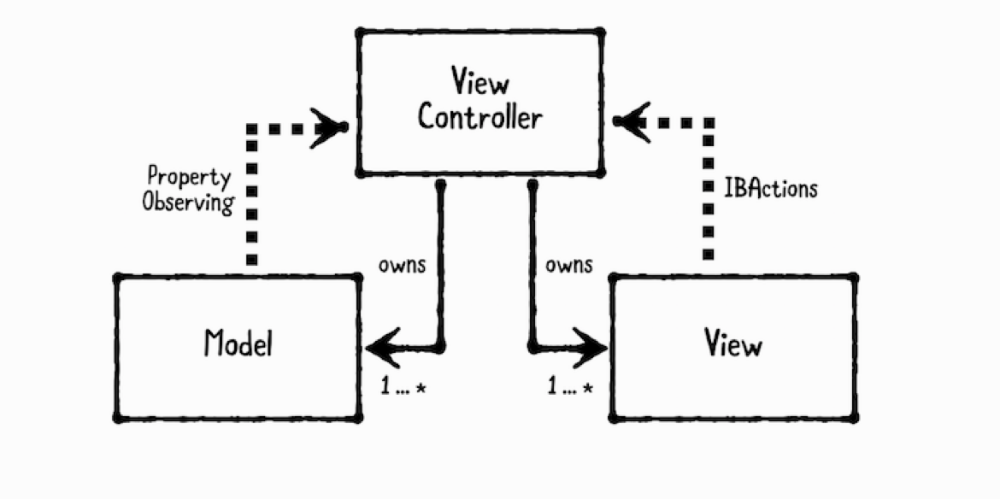

# Ch3. Model-View-Controller Pattern

****

- **Models**
  - data. 보통 struct거나 간단한 class로 되어 있다. 

- **Views**
  - visual elements. 보통 UIView의 subclass
- **Controllers**
  - model과 view를 조직화 한다. 보통 UIViewController의 subclass
-  UIKit은 MVC 패턴으로 되어있다. 
- Controller는 다수의 model과 view를 가지고 있고, 직접 접근하기 위해서 strong property로 가지고 있다. 
- model과 view는 controller를 strong reference하면 retain cycle이 생길 수도 있으므로 strong reference로 가지고 있지 않아야 한다. 
- model은 property observing을 통해서 controller와 통신하고, view는 IBActions을 통해서 controller와 통신한다. 
- model과 view는 주로 재사용하고, 로직을 담당하는 controller는 재사용하기 어렵다. 