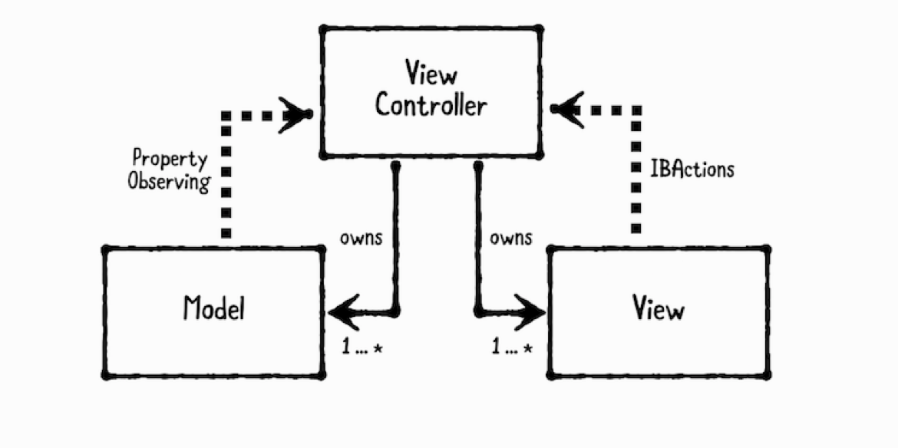
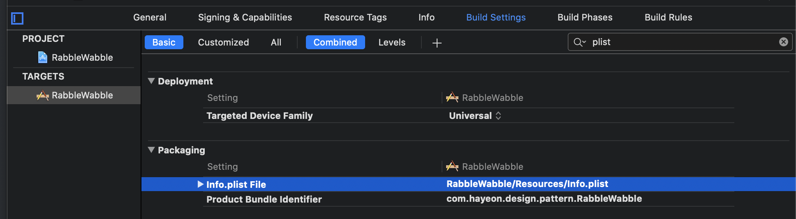

# Ch3. Model-View-Controller Pattern

****

- **Models**
  - data. 보통 struct거나 간단한 class로 되어 있다. 

- **Views**
  - visual elements. 보통 UIView의 subclass
- **Controllers**
  - model과 view를 조직화 한다. 보통 UIViewController의 subclass
-  UIKit은 MVC 패턴으로 되어있다. 
- Controller는 다수의 model과 view를 가지고 있고, 직접 접근하기 위해서 strong property로 가지고 있다. 
- model과 view는 controller를 strong reference하면 retain cycle이 생길 수도 있으므로 strong reference로 가지고 있지 않아야 한다. 
- model은 property observing을 통해서 controller와 통신하고, view는 IBActions을 통해서 controller와 통신한다. 
- model과 view는 주로 재사용하고, 로직을 담당하는 controller는 재사용하기 어렵다. 

## **Playgorund example**

- playground에서 Address MVC 구현.

## **What should you be careful about?**

- MVC만 쓴다면, controller에 많은 로직이 포함될 수 밖에 없고, controller가 매우 커질 수 있다.

## **Tutorial Project**

- info.plist 파일의 위치가 변경되면, info.plist의 위치를 명시해줘야한다.

  - TARGETS > Build Settings > Packaging > Info.plist File 에서 변경된 위치로 지정해준다.

    

- Question MVC 구현.

