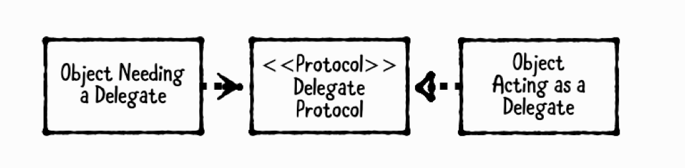

# Ch4. Delegation Pattern

- delegate pattern을 이용하면 직접 데이터를 제공하고 일을 수행하는 대신에, 다른 helper 오브젝트를 이용해서 대신하게 할 수 있다.

   

- **Object Needing a Delegate(delegating object)**
  - delegate를 가지고 있는 오브젝트
  - retain cycle를 피하기 위해서 주로 weak property로 delegate를 들고 있다. 
- **Delegate protocol**
  - implement 해야할 함수들을 정의한 protocol 
- **Delegate**
  - delegate protocol를 implement한 helper 오브젝트 

## When Should you use it? 

- 큰 클래스를 나누거나 generic을 만들거나 재 사용 가능한 component를 만들 때 delegate pattern을 사용하면 된다. 
- UIKit에서는 delegate pattern을 자주 사용한다. 
- **DataSource**
  - data를 제공할 때 사용
- **Delegate**
  - 데이터나 이벤트를 전달 받을 때 사용 

## Playground example

- playground에서 MenuVC delegate 구현.