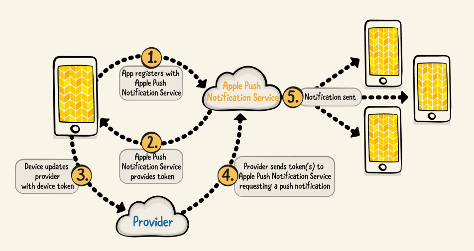

# Push Notifications

## Chapter2. Push Notifications
- notification은 시간이나 장소 같은 상태에 기반하여 locally 스케줄 될 수도 있고, remote 서비스에 의해서 스케줄 되고 당신의 디바이스에 push 될 수 있다.
- 일반적인 process는 다음과 같다.

  - Ask your user for permission to receive notifications.
    notification을 받을 것인지 permission을 사용자에게 요청.

  - Optionally make changes to the message before display.
    화면에 보이기 전에 메시지를 변경.

  - Optionally add custom buttons for the user to interact with.
    사용자와 상호작용하기 위한 커스텀 버튼 추가.

  - Optionally configure a custom user interface to display the notifications.
    사용자 인터페이스를 설정하여 notification 표시.

  - Optionally take action based on what the user did with the notification.  
    사용자가 notification에 어떤 반응을 했는지 기반으로 액션을 취함.

### What are they good for?

 notification은 다양한 것들을 할 수 있음
 - Display a messages.
 - playing a sound.
 - Updating the badge icon on your app.
 - showing an image or playing a movie.
 - Giving the user a way to pick from a few options.
 - **Anything that a UIViewController can implement.**

notification 화면에 적합하다면 모든 타입의 사용자 인터페이스를 기술적으로 보여줄 수는 있지만, 그렇게 해야만 한다는 것은 아님. 항상 사용자 입장에서 notification을 디자인 해야 함. 사용자가 그것을 보고 싶을까? 듣고 싶을가? 상호작용 하고 싶을까?

### Remote Notifications

- notification은 주로 웹 서버처럼 클라우드 서버와 같은 remote notification에서 많이 사용된다. 
- Apple은 Transport Layer Security(TLS)를 사용하는 Apple Push Notification service(APNs)를 만듬.
- TLS은 나의 앱의 notification을 나만 관리 할 수 있게 프라이버스와 데이터 무결성을 제공한다. 

##### Security

- APNs는 암호화 검증 및 인증을 사용하여 메시지의 보안을 보장함.

- Provider라고 불리는 나의 서버는 Apple에게 notification 요청을 보내기 위해 TLS를 사용.

- Device는 APNs가 decode할 수 있는 고유한 식별자를 포함한 device token을 사용.

- iOS Device는 APNs와 인증이 되면,  token(아마도 새로운)을 받음. token은 나중에 notification을 받기 위해 provider(내 서버)에 전달.

- You should never cache a device token on the user’s device as there are multiple instances in which APNs will need to generate a new token, such as installing the app on a new device or performing a restore from a backup.

  device token을 사용자 device에 cache하면 안됨. 새로운 device에 앱 설치나 backup을 다시 설치 하는 등 APNs가 새로운 token을 만들어야 할 필요가 있을 수도 있기 떄문이다.

- 이 device token은 사용자의 특정 device를 가리킬 때 사용 됨. provider가 notification을 보내고 싶으면 APNs에게 특정 token을 보내면 됨. 

##### Notification message flow

- APNs에 앱을 등록하는 단계 부터 실제로 사용자가 notification을 받는 단계까지 이해하는 것이 중요.

  1. `application(_:didFinishLaunchingWithOptions:)`,  **registerForRemoteNotifications()**를 통해서 device token을 얻기 위한 APNs에 요청을 날림. 

  2. `application(_:didRegisterForRemoteNotificationsWithDeviceToken:)`: token을 return.

     `application(_:didFailToRegisterForRemoteNotificationsWithError:)`: 에러를 return.

  3. Device는 provider에게 binary나 hexadecimal format으로 token을 전달. provider는 그 token을 트랙킹 함. 

  4. provider는 한개 이상의 토큰을 포함해서 APNs에게 notification 요청을 보냄.

  5. token이 유효하면 각각의 device에 notification을 보냄.

### 

### Local notifications

- local notification은 remote provider가 device로 보내는 것이 아니라 device에서 만들고 관리한다. 
- local notification은 remote notification과 동일한 특징을 가짐. 
- 유일한 차이는, local notification은 시간의 흐름, 특정 지역에 입장/존재 하는 것에 의하여 유발된다. 

### Location aware

- 사용자의 위치 기반으로 notification을 보낼 수 있음.
- 예를 들어 특정 위치에 들어오면 쿠폰을 보낸다. 

### Key points

- Push notification은 앱의 일반적인 flow를 벗어나서 사용자와 상호작용 할 수 있게 해줌.
- 지역을 기반으로 한 notification이 될 수도 있고, remote 서비스로 부터 device에 "push"될 수도 있음.
- Remote notification은 흔한 타입이고, notification을 만들고 보내기 위해서 cloud service를 사용.
- APNs 덕분에 notification 메세지의 보안이 보장 됨.
- local notification은 remote notification과 달리 device에서 만들어지고 관리 됨.